# tamapi

## Flowchart

```mermaid
graph LR;
	main["🐈 tamapi"]-->pe["Pet Endpoints"];
	pe-->|"POST /pets"|createpet["Create a pet"];
	pe-->|"GET /pets"|getpets["List user's pets"];
	pe-->|"GET /pets/{id}"|getpetid["Get pet details"];
	pe-->|"PATCH /pets/{id}"|patchpet["Update pet (rename etc.)"];
	pe-->|"DELETE /pets/{id}"|deletepet["Delete pet"];
	main["🐈 tamapi"]-->auth["Auth"];
	auth-->|"POST /register"|register["Create user"]
	auth-->|"POST /login"|login["Authenticate user"]
	auth-->|"GET /profile"|profile["Get user info"]
	main["🐈 tamapi"]-->pac["Pet Actions"];
	pac["Pet Actions"]-->|"POST /pets/{id}/feed"|petfeed["Reduce hunger"]
	pac["Pet Actions"]-->|"POST /pets/{id}/play"|petplay["Increase happiness, reduce energy"]
	pac["Pet Actions"]-->|"POST /pets/{id}/sleep"|petsleep["Restore energy, time-based"]
	pac["Pet Actions"]-->|"POST /pets/{id}/clean"|petclean["Increase hygiene"]
	pac["Pet Actions"]-->|"POST /pets/{id}/heal"|petheal["Restore health (if sick)"]
	main["🐈 tamapi"]-->plc["Lifecycle"];
    plc-->|"GET /pets/{id}/status"|petstatus["Get real-time pet stats"]
    plc-->|"GET /pets/{id}/history"|pethistory["Past actions log"]
	main["🐈 tamapi"]-->pmp["Multiplayer"];
    pmp-->|"POST /friends/{id}/send-gift"|petgift["Send items"]
    pmp-->|"POST /pets/{id}/battle"|petbattle["Battle with other pets"]
    pmp-->|"GET /leaderboard"|leaderbord["See top pets/users"]
	main["🐈 tamapi"]-->pmp["Store"];
    pmp-->|"POST /store/buy"|butstore["Buy items"]
    pmp-->|"POST /store/sell"|sellstore["Sell back items"]
    pmp-->|"GET /store"|browsestore["Browse available items"]
```

## Additional Information

### Pet Attributes

- Name
- Type (cat, dog alien etc.)
- Age
- Health
- Happiness
- Hunger
- Energy
- Hygiene

### Pet Actions

- Different foods affecting stats differently
- Cooldown on actions
- Random sickness events

### Pet Lifecycle

- Pets grow older
- Pets can get sick or unhappy if neglected
- Auto-decay stats over time

### Pet Store

- Food
- Toys
- Medicine
